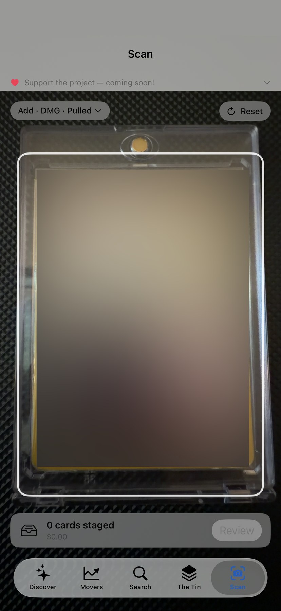
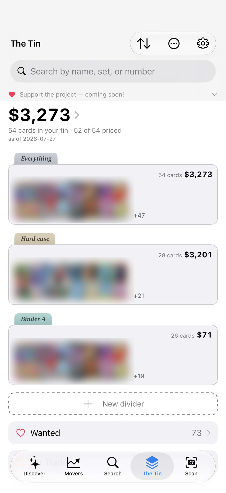
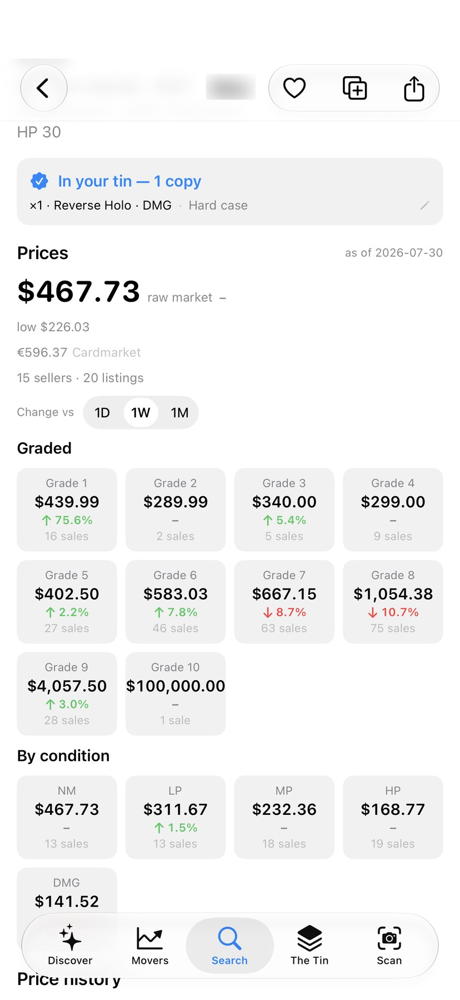
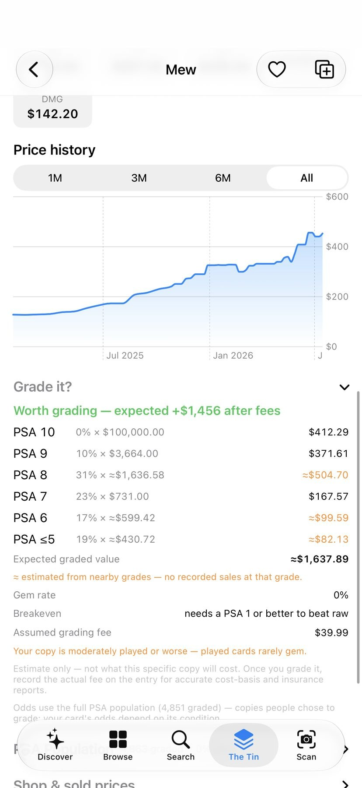

<h1 align="center">The Tin</h1>

<p align="center">
  <strong>A free, open source collector app — for collectors, by collectors.</strong><br>
  Scan a card, know what it's worth, keep your collection yours.
</p>

<p align="center">
  <a href="https://apps.apple.com/app/id6788516920">
    
  </a>
</p>

<p align="center">
  <a href="https://apps.apple.com/app/id6788516920"></a>
  
  
  
</p>

<p align="center">
  
  
  
  
</p>

> Card artwork and card names are blurred in these captures. The app itself shows them
> normally — see [Trademarks & fair use](#license) for why.

---

**No ads. No paywall. No subscription. No account.** Every competitor meters something —
the scanner, price history, the export button. The Tin doesn't, and the code is here so
you can check.

The Tin is an iOS app for tracking a trading card collection: scan cards with the
camera (entirely on-device), organize them into groups, follow their market value
over time, and know what your collection is worth — without ads, subscriptions,
or your collection leaving your phone.

**[⬇︎ Download on the App Store](https://apps.apple.com/app/id6788516920)** · iOS 17+, iPhone and iPad

## Why "The Tin"?

Every kid who collected had one: the tin. The binder held the bulk, but the tin held
the *loved* cards — the holos, the reverse holos, the EXes, the ones that got
played with and traded and looked at a hundred times. Above the binder in the
hierarchy of the heart.

This app is that tin, digitized.

## Goal

Collection trackers keep drifting toward paywalls: the scanner is metered, price
history is premium, the export button costs a subscription. The Tin's goal is a
collector-grade tracker where everything works, free, forever:

- **Free, with no feature gates.** No ads, no premium tier, no scan limits.
- **Private and offline-first.** Your collection lives on your device. Card
  recognition runs entirely on-device — photos of your cards are never uploaded.
- **Community funded, in the open.** Running costs are covered by donations with
  a public ledger. Money and code are both welcome; neither buys influence.
- **Open source.** The app and its backend are AGPL-3.0 — inspect it, fork it,
  self-host it.

## Status & roadmap

**v1.0 is live on the App Store** as of 2026-07-31 — iPhone and iPad, iOS 17+.
[Download it here](https://apps.apple.com/app/id6788516920).

Next up: multi-device sync over iCloud, trading tools, and an Android translation
of the app on Google Play. Bugs and feature requests are welcome in
[issues](../../issues) — early reports get acted on fast.

## Features

### Collection
- **Your tin, organized** — group cards however you collect (sets, decks, boxes,
  binders), with per-group stats and totals.
- **Wishlist** — track the cards you're hunting, separate from what you own.
- **Variants and conditions** — normal, holo, reverse holo; condition per copy;
  price paid vs. market value.
- **CSV import and export** — your data is yours; get it in and out in plain CSV.

### Scanning
- **On-device card scanner** — point the camera at a card and it's recognized in
  seconds, including holos and cards in binder pockets.
- **No cloud, no limits** — recognition combines on-device OCR with a downloadable
  visual fingerprint pack, so scanning works offline and no image ever leaves
  your phone.
- **Batch-friendly flow** — scans land in a staging tray to review, adjust
  variant/condition, and route to a group in bulk.

### Prices & portfolio
- **Market prices** — USD prices for every card, from open TCG data
  sources, refreshed daily.
- **Price history** — sparkline trends per card and portfolio value history for
  your whole collection.
- **Condition & graded pricing** — per-condition prices and PSA graded prices
  (funded by community donations), plus population data.
- **Grading ROI** — see whether grading a card is worth it before you send it in.
- **Sealed products** — see market prices for tins, ETBs, and booster boxes
  alongside each set.

### Browse & discover
- **Full card catalog** — browse and search every set, with a Dex view to
  explore by creature.
- **Discover streams** — For You, chase cards, and full-art streams, recommended
  by on-device affinity (your taste data stays local).

### Reports & extras
- **Insurance report** — generate a printable PDF of your collection with values,
  for insurance or records.
- **Print sheets** — binder-style sheets of your cards for printing.
- **Home screen widget** — collection value at a glance.
- **Light / dark / system appearance.**

## What's in this repository

| Directory | What it is |
|---|---|
| `ios/` | The SwiftUI app (Xcode project generated with [XcodeGen](https://github.com/yonaskolb/XcodeGen) from `ios/project.yml`) |
| `catalog-server/` | Self-hostable catalog server — a thin, App Attest–gated static file server (Docker) that serves the card catalog and scanner fingerprint pack |
| `functions/` | The catalog data pipeline (Docker, `Dockerfile.pipeline`) — nightly build of the card-catalog SQLite from open data feeds, price enrichment, and 3-tier packaging/publishing |
| `fingerprint/` | The scanner's fingerprint pipeline — builds the visual recognition pack (ORB descriptors + vector-quantized codebook) from catalog card images |
| `test_images/` | Real card photos used by the scanner's accuracy evaluation (`test_images/images.csv` holds the ground-truth labels) |

Card metadata and raw prices come from open data sources —
[TCGdex](https://tcgdex.dev), [tcgcsv](https://tcgcsv.com) (TCGplayer USD), and
Cardmarket EUR trends. Graded prices and population data come from a commercial
API, paid for by community funding.

## Building the app

```bash
brew install xcodegen
cd ios
xcodegen generate
open TheTin.xcodeproj
```

The app builds and runs without any secrets. Firebase-backed extras (mirrored
card images, the hosted catalog fallback) need your own Firebase project and a
`GoogleService-Info.plist` (gitignored — the app treats it as optional).

Backend tests:

```bash
cd catalog-server && npm install && npm test   # catalog server
cd fingerprint && pytest                        # fingerprint pipeline
```

## Contributing

Bug reports, card data corrections, and small focused PRs are all welcome — see
[CONTRIBUTING.md](CONTRIBUTING.md). Changes land through pull requests only;
please open an issue before starting anything large.

## Branching & releases

The repo follows a three-tier branch doctrine:

```
feature/* ──PR──▶ staging ──promotion──▶ main
```

- **`main` — App Store releases.** Each release is tagged on the exact commit that
  was archived and reviewed — `v1.0` points at the binary Apple approved.
- **`staging` — TestFlight builds.** The long-lived integration branch that
  internal testers run. Every TestFlight upload is archived from `staging` and
  tagged with its release and TestFlight build number (`vX.Y.Z-buildN`), so any
  commit can be traced to the build testers are holding.
- **`feature/*` — feature branches.** All work happens here and rolls into
  `staging` through pull requests — never directly into `main`.

**Promotion:** when a TestFlight build starts serving more than internal testers
(open beta), that build's commit is promoted to `main` and tagged as a release.

## License

Code is licensed under [AGPL-3.0](LICENSE). The name "The Tin", the app icon,
and the App Store presence are not part of the license — see
[TRADEMARK.md](TRADEMARK.md). If you distribute a modified version, rebrand it.

### Trademarks & fair use

The Tin is an independent fan project. It is not affiliated with, endorsed by,
or sponsored by Nintendo, The Pokémon Company, or Creatures Inc. Pokémon and all
card images and names are trademarks of their respective owners, used here only
to identify the cards a collector owns.

Card artwork and card names are blurred in the screenshots above and in the App
Store listing. The app displays them normally — a collection tracker that can't
show you your cards would be useless. The blurring is a deliberate choice about
*promotional* material, not a limitation of the app.
